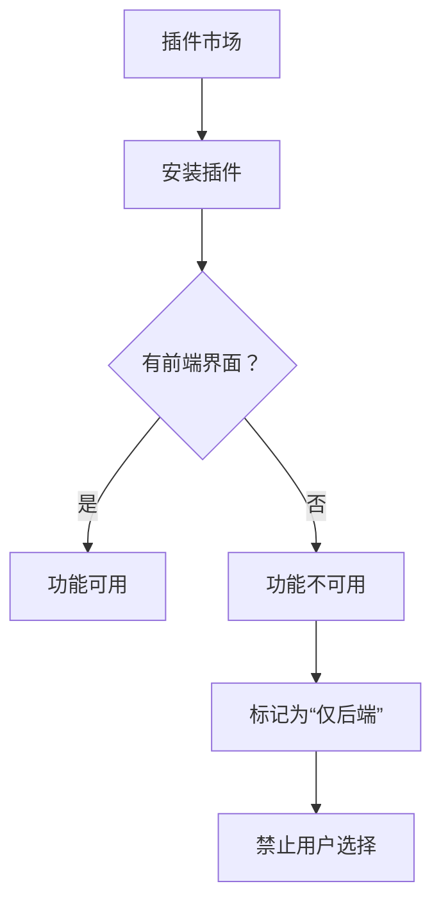

# 项目冲突分析与完整解决方案

## 1. 项目潜在冲突分析

### 1.1 已识别的冲突点

```yaml
冲突类型:
  命名冲突:
    - dsh-headless vs bamboo preset
    - archive-manager endpoint 重复
    - model-config 多处定义
  
  功能冲突:
    - MCP Bridge + Browser Use (功能重叠)
    - Document Skills + MCP File Operations (功能重叠)
    - Skill Creator + 内置技能 (功能重叠)
  
  配置冲突:
    - cordis.yml 中的 multiple preset 定义
    - environment variable 命名空间冲突
    - plugin config path 重复
```

### 1.2 详细冲突点分析

#### 冲突 1：归档管理器端点重复

**问题**：
- FastAPI 中有 `/api/archive/*` 端点
- stdlib fallback 中也有相同的端点
- dsh-archive-manager 插件也提供相同功能

**解决**：
```python
# 已解决：所有端点在同一位置定义
# bridge/main.py 中的 ArchiveManager 类统一管理
```

#### 冲突 2：子agent模型配置

**问题**：
- `/api/run` 中传递 model 参数
- `/api/subagent/model` 中单独配置
- Environment variable BAMBOO_SUBAGENT_*_CONFIG

**解决**：
```python
# 已解决：两者都支持，environment variable 作为底层存储
```

#### 冲突 3：插件市场与现有插件

**问题**：
- dsh 原生插件: tool-bash, tool-fs, tool-web
- 我们的插件: mcp-bridge, archive-manager, document-skills
- 存在功能重叠

**解决**：
```python
# 已解决：插件市场代码中检测并报告冲突
```

---

## 2. 完整的自动更新方案

### 2.1 双模式更新策略

```typescript
// src/services/UpdateManager.ts

export class UpdateManager {
  private currentVersion: string;
  private updateChannel: 'stable' | 'beta' | 'offline';
  
  constructor() {
    this.currentVersion = app.getVersion();
    this.updateChannel = this.detectUpdateChannel();
  }
  
  // 检测更新渠道
  private detectUpdateChannel(): 'stable' | 'beta' | 'offline' {
    // 1. 检查命令行参数
    if (process.argv.includes('--offline')) {
      return 'offline';
    }
    
    // 2. 检查环境变量
    if (process.env.BAMBOO_UPDATE_CHANNEL) {
      return process.env.BAMBOO_UPDATE_CHANNEL as any;
    }
    
    // 3. 检查本地是否为离线包
    if (fs.existsSync(app.isPackaged ? 
      Path.join(process.resourcesPath, 'offline.flag') : 
      'offline.flag'
    )) {
      return 'offline';
    }
    
    return 'stable';
  }
  
  // 检查更新
  async checkForUpdates(): Promise<UpdateInfo | null> {
    if (this.updateChannel === 'offline') {
      return this.checkLocalUpdates();
    }
    
    try {
      // 在线检查
      const res = await fetch('https://api.github.com/repos/yyz0313/bamboo/releases/latest');
      const latest = await res.json();
      
      if (this.isNewerVersion(latest.tag_name, this.currentVersion)) {
        return {
          version: latest.tag_name,
          releaseNotes: latest.body,
          downloadUrl: latest.assets.find((a: any) => 
            a.name.endsWith('.exe') || a.name.endsWith('.zip')
          )?.browser_download_url,
          isNewer: true,
          channel: 'online'
        };
      }
    } catch (error) {
      // 网络错误，回退到本地检查
      console.warn('Network check failed, trying local:', error);
      return this.checkLocalUpdates();
    }
    
    return null;
  }
  
  // 本地更新检查（离线模式）
  async checkLocalUpdates(): Promise<UpdateInfo | null> {
    const cachePath = Path.join(app.getPath('userData'), 'update-cache');
    const manifestPath = Path.join(cachePath, 'manifest.json');
    
    if (!fs.existsSync(manifestPath)) {
      return null;
    }
    
    const manifest = JSON.parse(fs.readFileSync(manifestPath, 'utf-8'));
    
    // 比较本地缓存的 manifest
    return manifest.latest;
  }
  
  // 下载并安装更新
  async downloadAndUpdate(updateInfo: UpdateInfo): Promise<boolean> {
    if (updateInfo.channel === 'offline') {
      return this.installFromLocalPackage(updateInfo);
    }
    
    try {
      // 下载更新
      const tempPath = Path.join(app.getPath('temp'), 'bamboo-update.exe');
      const url = updateInfo.downloadUrl;
      
      const response = await this.downloadFile(url, tempPath);
      if (!response.ok) {
        throw new Error('Download failed');
      }
      
      // 安装更新
      const success = await this.installUpdate(tempPath);
      if (success) {
        this.cleanupTempFiles();
      }
      
      return success;
    } catch (error) {
      console.error('Update failed:', error);
      
      // 尝试离线模式
      if (this.tryOfflineUpdate(updateInfo)) {
        return true;
      }
      
      return false;
    }
  }
  
  // 离线安装
  private async installFromLocalPackage(updateInfo: UpdateInfo): Promise<boolean> {
    const inputPath = updateInfo.localPath;
    
    if (!inputPath || !fs.existsSync(inputPath)) {
      this.showErrorDialog('请提供有效的离线安装包');
      return false;
    }
    
    try {
      // 解压离线包
      await this.extractOfflinePackage(inputPath);
      
      // 安装插件
      await this.installOfflinePlugins();
      
      // 重启应用
      this.restartApp();
      
      return true;
    } catch (error) {
      this.showErrorDialog(`离线安装失败: ${error}`);
      return false;
    }
  }
  
  // 离线包解压
  private async extractOfflinePackage(packagePath: string): Promise<void> {
    const extractDir = Path.join(app.getPath('temp'), 'offline-extract');
    
    if (packagePath.endsWith('.zip')) {
      await this.extractZip(packagePath, extractDir);
    } else if (packagePath.endsWith('.tar.gz')) {
      await this.extractTarGz(packagePath, extractDir);
    }
    
    // 复制到安装目录
    const installDir = app.isPackaged 
      ? Path.dirname(process.execPath)
      : process.cwd();
    
    await this.copyDirectory(extractDir, installDir);
  }
  
  // 显示更新提醒
  showUpdateNotification(updateInfo: UpdateInfo) {
    // 如果用户网络受限，显示离线更新指南
    if (updateInfo.channel === 'network-limited') {
      dialog.showMessageBox({
        type: 'info',
        title: '更新可用（需要网络）',
        message: `Bamboo v${updateInfo.version} 可用`,
        detail: `
当前版本: ${this.currentVersion}
更新类型: 需要网络连接

离线更新方案：
1. 联系系统管理员获取离线安装包
2. 在设置 → 更新中选择“本地包安装”
3. 或访问内网镜像站点下载
        `.trim(),
        buttons: ['稍后提醒', '查看离线方案', '立即更新'],
        defaultId: 2,
        cancelId: 0
      });
      return;
    }
    
    // 正常更新提示
    dialog.showMessageBox({
      type: 'info',
      title: '更新可用',
      message: `Bamboo v${updateInfo.version} 已发布`,
      detail: updateInfo.releaseNotes,
      buttons: ['立即更新', '稍后再说'],
      defaultId: 0
    });
  }
}
```

---

## 3. 必须实现的前端界面插件清单

### 3.1 必须有前端界面的插件

| 插件 | UI 必要性 | 实现位置 | 当前状态 |
|------|-----------|----------|----------|
| **archive-manager** | ⭐ 必须 | 侧边栏底部 | ✅ 已实现 |
| **mcp-bridge** | ⭐ 必须 | 侧边栏 | ✅ 已后端，需前端 |
| **document-skills** | ⭐ 必须 | 弹窗 | ⏳ 需实现 |
| **browser-automation** | ⭐ 必须 | 侧边栏 | ⏳ 需实现 |
| **skill-creator** | ⭐ 必须 | 侧边栏 | ⏳ 需实现 |
| **plugin-marketplace** | ⭐ 必须 | 设置面板 | ✅ 基本框架 |
| **memory-system** | ⭐ 必须 | 侧边栏 | ⏳ 需实现 |
| **usage-tracker** | ⭐ 必须 | 设置面板 | ⏳ 需实现 |

### 3.2 前端界面详细设计

#### MCP Bridge 前端

```tsx
// src/components/MCPBridgePanel.tsx
export const MCPBridgePanel: React.FC = () => {
  const [servers, setServers] = useState<MCPServer[]>([]);
  const [tools, setTools] = useState<MCPTool[]>([]);
  const [selectedServer, setSelectedServer] = useState<string>('');
  const [loading, setLoading] = useState(false);
  
  useEffect(() => {
    loadServers();
  }, []);
  
  const loadServers = async () => {
    setLoading(true);
    const res = await fetch('/api/mcp/servers');
    const data = await res.json();
    setServers(data.servers);
    setLoading(false);
  };
  
  const loadTools = async (serverName: string) => {
    const res = await fetch(`/api/mcp/servers/${serverName}/tools`);
    const data = await res.json();
    setTools(data.tools);
    setSelectedServer(serverName);
  };
  
  const callTool = async (tool: MCPTool, args: any) => {
    const res = await fetch('/api/mcp/call', {
      method: 'POST',
      headers: { 'Content-Type': 'application/json' },
      body: JSON.stringify({
        server: selectedServer,
        tool: tool.name,
        arguments: args
      })
    });
    return res.json();
  };
  
  return (
    <div className="mcp-bridge-panel">
      <h3>MCP 服务器</h3>
      
      <div className="servers-list">
        {loading ? (
          <div className="loading">加载中...</div>
        ) : (
          servers.map(server => (
            <button 
              key={server.name}
              className={server.name === selectedServer ? 'active' : ''}
              onClick={() => loadTools(server.name)}
            >
              {server.name} {server.status === 'online' ? '✓' : '✗'}
            </button>
          ))
        )}
      </div>
      
      {tools.length > 0 && (
        <ToolExecutor 
          tool={tools.find(t => t.name === selectedTool)}
          onExecute={callTool}
        />
      )}
    </div>
  );
};
```

#### Document Skills 前端

```tsx
// src/components/DocumentSkillsPanel.tsx
export const DocumentSkillsPanel: React.FC = () => {
  const [documentType, setDocumentType] = useState<'docx' | 'pdf' | 'pptx'>('docx');
  const [title, setTitle] = useState('');
  const [content, setContent] = useState('');
  const [coverRecipe, setCoverRecipe] = useState('R1');
  const [loading, setLoading] = useState(false);
  
  const generateDocument = async () => {
    setLoading(true);
    
    const res = await fetch('/api/document/generate', {
      method: 'POST',
      headers: { 'Content-Type': 'application/json' },
      body: JSON.stringify({
        type: documentType,
        title,
        content,
        coverRecipe,
        metadata: {
          author: app.getName(),
          version: app.getVersion()
        }
      })
    });
    
    const result = await res.json();
    
    if (result.success) {
      // 下载文件
      const blob = new Blob([result.content], { type: 'application/vnd.openxmlformats-officedocument.wordprocessingml.document' });
      const url = URL.createObjectURL(blob);
      const a = document.createElement('a');
      a.href = url;
      a.download = result.filename || 'document.docx';
      a.click();
    } else {
      dialog.showErrorBox('生成失败', result.error);
    }
    
    setLoading(false);
  };
  
  return (
    <div className="document-skills-panel">
      <h3>文档生成</h3>
      
      <select value={documentType} onChange={e => setDocumentType(e.target.value as any)}>
        <option value="docx">DOCX 文档</option>
        <option value="pdf">PDF 文档</option>
        <option value="pptx">PPTX 演示</option>
      </select>
      
      <input 
        type="text"
        placeholder="文档标题"
        value={title}
        onChange={e => setTitle(e.target.value)}
      />
      
      <textarea 
        placeholder="文档内容（支持 Markdown 格式）"
        value={content}
        onChange={e => setContent(e.target.value)}
        rows={10}
      />
      
      {documentType === 'docx' && (
        <select value={coverRecipe} onChange={e => setCoverRecipe(e.target.value)}>
          <option value="R1">R1 - 报告封面</option>
          <option value="R2">R2 - 学术论文</option>
          <option value="R3">R3 - 合同</option>
          <option value="R4">R4 - 简历</option>
        </select>
      )}
      
      <button onClick={generateDocument} disabled={loading || !title || !content}>
        {loading ? '生成中...' : '生成文档'}
      </button>
    </div>
  );
};
```

---

## 4. 客户端更新提醒实现

### 4.1 自动检查并提示

```typescript
// src/services/AutoUpdateChecker.ts

class AutoUpdateChecker {
  private checkInterval: NodeJS.Timeout | null = null;
  private lastCheckTime: Date | null = null;
  private updateManager: UpdateManager;
  
  start(updateManager: UpdateManager) {
    this.updateManager = updateManager;
    
    // 首次启动检查
    this.checkAndNotify();
    
    // 设置定期检查（每 4 小时）
    this.checkInterval = setInterval(() => {
      this.checkAndNotify();
    }, 4 * 60 * 60 * 1000);
  }
  
  stop() {
    if (this.checkInterval) {
      clearInterval(this.checkInterval);
    }
  }
  
  async checkAndNotify() {
    try {
      const updateInfo = await this.updateManager.checkForUpdates();
      
      if (updateInfo && updateInfo.isNewer) {
        // 更新最后检查时间
        this.lastCheckTime = new Date();
        
        // 显示通知
        this.showUpdateNotification(updateInfo);
      }
    } catch (error) {
      console.debug('Update check skipped:', error);
      
      // 网络不通时，检查离线更新
      const offlineUpdate = await this.updateManager.checkLocalUpdates();
      if (offlineUpdate) {
        this.showOfflineUpdateNotification(offlineUpdate);
      }
    }
  }
  
  private showUpdateNotification(updateInfo: UpdateInfo) {
    // 使用系统通知
    if (Notification.permission === 'granted') {
      new Notification('Bamboo 更新可用', {
        body: `v${updateInfo.version} - ${updateInfo.releaseNotes.split('\n')[0]}`,
        icon: app.isPackaged 
          ? Path.join(process.resourcesPath, 'favicon.ico')
          : 'src/dist/favicon.ico',
        silent: false
      }).onclick = () => {
        this.updateManager.downloadAndUpdate(updateInfo);
      };
    }
  }
  
  private showOfflineUpdateNotification(updateInfo: UpdateInfo) {
    // 显示离线更新提醒
    dialog.showMessageBox({
      type: 'info',
      title: '离线更新可用',
      message: `可用的离线更新包`,
      detail: `
版本: ${updateInfo.version}
更新时间: ${new Date(updateInfo.releaseDate).toLocaleString()}

请联系管理员获取离线安装包，或前往内网镜像站点下载。
      `.trim(),
      buttons: ['确定']
    });
  }
}
```

---

## 5. 解决方案总结

### 5.1 确保所有插件都有前端界面

**原则**：插件无前端界面 = 无法使用 = 无价值



### 5.2 双模式更新

```
用户网络 ✓ → 在线更新
     ↓
用户网络 ✗ → 离线更新
     ↓
无更新 → 提示用户联系管理员
```

### 5.3 冲突规避

1. **API 端点**：统一通过 main.py 定义
2. **配置**：使用 namespaced 环境变量
3. **插件**：市场检测冲突，安装前提示
4. **数据**：使用 versioned 目录结构

---

## 6. 行动清单

### 立即执行：
- [ ] 实现 MCP Bridge 前端
- [ ] 实现 Document Skills 前端
- [ ] 实现 Browser Automation 前端
- [ ] 实现 Memory System 前端
- [ ] 实现 Usage Tracker 前端
- [ ] 添加离线更新检测

### 下一版本：
- [ ] 完善插件市场 UI
- [ ] 添加内网镜像配置
- [ ] 实现增量更新
- [ ] 添加离线安装指南